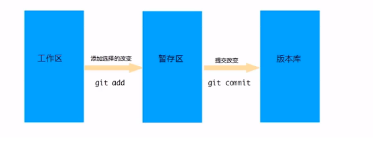

[TOC](Git常用命令及在IDEA中的使用)

# Git常用命令及在IDEA中的使用

# 1 Git 概述

## 1.1 Git 简介

Git 是一个分布式版本控制工具，通常用来对软件开发过程中的源代码文件进行管理。通过Git 仓库来存储和管理这些文件，Git 仓库分为两种:

- 本地仓库:开发人员自己电脑上的 Git 仓库
- 远程仓库:远程服务器上的 Git 仓库


commit:提交将本地文件和版本信息保存到本地仓库

push:推送,将本地仓库文件和版本信息上传到远程仓库

pull: 拉取,将远程仓库文件和版本信息下载到本地仓库


## 1.2 Git 下载与安装

下载地址: https://git-scm.com/download


下载完成后得到安装文件:Git-2.20.164-bit.exe

安装完成后在任意目录点击鼠标右键，如果能看到如下菜单则表示安装完成


- Git GUI Here: 打开Git 图形界面
- Git Bash Here: 打开Git 命令行


# 2 Git 代码托管服务

## 2.1 常用的Git 代码托管服务

Git中存在两种类型的仓库，即本地仓库和远程仓库。那么我们如何搭建Git远程仓库呢?
我们可以借助互联网上提供的一些代码托管服务来实现，其中比较常用的有GitHub、码云、GitLab等。

- gitHub( 地址: https://github.com/)，是一个面向开源及私有软件项目的托管平台，因为只支持Git 作为唯的版本库格式进行托管，故名gitHub
- 码云(地址: https://gitee.com/)，是国内的一个代码托管平台，由于服务器在国内，所以相比于GitHub，码云速度会更快
- GitLab(地址: https://about.gitlab.com/)，是一个用于仓库管理系统的开源项目，使用Git作为代码管理工具，并在此基础上搭建起来的web服务
- BitBucket(地址: https://bitbucket.org/) ，是一家源代码托管网站，采用Mercurial和Git作为分布式版本控制系统，同时提供商业计划和免费账户


## 2.2 使用码云代码托管服务

使用码云的操作流程如下
1、注册码云账号
2、登录码云
3、创建远程仓库
4、邀请其他用户成为仓库成员


# 3 Git 常用命令

## 3.1 Git 全局设置

当安装Git后首先要做的事情是设置用户名称和email地址。这是非常重要的，因为每次Git提交都会使用该用户信息。
在Git 命令行中执行下面命令:

- 设置用户信息

```commonlisp
git config --global user.name "itcast"
git config --global user.email "hello@itcast.cn"
```

- 看配置信息

```comm
git config --list
```

注意:上面设置的user.name和user.email并不是我们在注册码云账号时使用的用户名和邮箱，此处可以任意设置。


## 3.2 获取 Git 仓库

获取Git仓库通常有两种方式:

- 在本地初始化一个Git仓库 (不常用)

执行步骤如下:

1. 在任意目录下创建一个空目录(例如repo1)作为我们的本地Git仓库
2. 进入这个目录中，点击右键打开Git bash窗口
3. 执行命令`git init`

如果在当前目录中看到`.git`文件夹(此文件夹为隐藏文件夹)则说明Git仓库创建成功


- 从远程仓库克隆(常用)

可以通过Git提供的命令从远程仓库进行克隆，将远程仓库克隆到本地

命令形式: `git clone [远程Git仓库地址]`


## 3.3 工作区、暂存区、版本库 概念

**版本库:**前面看到的`.git`隐藏文件夹就是版本库，版本库中存储了很多配置信息、日志信息和文件版本信息等

**工作区:**包含`.git`文件夹的目录就是工作区，也称为工作目录，主要用于存放开发的代码

**暂存区:**`.git`文件夹中有很多文件，其中有一个index文件就是暂存区，也可以叫做stage。暂存区是一个临时保存修改文件的地方




## 3.4 Git工作区中文件的状态

Git工作区中的文件存在两种状态:

- untracked 未跟踪(未被纳入版本控制)
- tracked 已跟踪(被纳入版本控制)
  1. Unmodified 未修改状态
  2. Modified 已修改状态
  3. staged 已暂存状态

==*注意: 这些文件的状态会随着我们执行Git的命令发生变化*==


## 3.5 本地仓库操作

本地仓库常用命令如下

```commonlisp
git status  #查看文件状态
git add		#将文件的修改加入暂存区
git reset	#将暂存区的文件取消暂存或者是切换到指定版本
git commit -m "message" <file> #将暂存区的文件修改提交到版本库	
git log		#查看日志
```


## 3.6 远程仓库操作

远程仓库的一些操作，具体包括:

```commonlisp
git remote		#查看远程仓库
git remote add <shortname> <url> #添加远程仓库
git clone <url> #从远程仓库克隆
git pull <remotr-name> <branch-name> #从远程仓库拉取 
git push <remotr-name> <branch-name> #推送到远程仓库		
```

- 如果想查看已经配置的远程仓库服务器，可以运行 dit remote 命令，它会列出每一个远程服务器的简写如果已经克隆了远程仓库，那么至少应该能看到 origin ，这是 Git 克隆的仓库服务器的默认名字。


- 注意:如果当前本地仓库不是从远程仓库克隆，而是本地创建的仓库，并且仓库中存在文件，此时再从远程仓库拉取文件的时候会报错` (fatal: refusing to merge unrelated histories )`

解决此问题可以在`git pull`命令后加入参数`--allow-unrelated-histories`


## 3.7 分支操作

分支是Git 使用过程中非常重要的概念。使用分支意味着你可以把你的工作从开发主线上分离开来，以免影响开发主线。同一个仓库可以有多个分支，各个分支相互独立，互不干扰。

通过git init 命令创建本地仓库时默认会创建一个master分支

关于分支的相关命令，具体如下:

```commonlisp
git branch			# 查看分支
git branch [name]	# 创建分支
git checkout [name]	# 切换分支
git push [shortName][name]	# 推送至远程仓库分支
git merge [name] 	# 合并分支
```

- 分支操作-**查看分支**
  `git branch ` 列出所有本地分支
  `git branch -r` 列出所有远程分支
  `git branch -a` 列出所有本地分支和远程分支


- merge 合并分支后，会弹出编辑模式，输入`i`可以编辑合并信息，按`esc`键，输入`:wq`，表示保存退出

- merge合并操作出现冲突后，需要手动修改文件，然后再执行`add`操作，提交时需要在`commit` 后添加`-i`参数

  

  

## 3.8 标签操作

Git 中的标签，**指的是某个分支某个特定时间点的状态**。通过标签，可以很方便的切换到标记时的状态。比较有代表性的是人们会使用这个功能来标记发布结点 (v1.0、v1.2等)。

下和标签相关的命令：

```commonlisp
git tag			# 列出已有的标签
git tag [name]	# 创建标签
git push [shortName] [name] # 将标签推送至远程仓库
git checkout -b [branch][name] # 检出标签
```


# 4 在IDEA中使用Git

## 4.1 在IDEA中配置Git

在IDEA中使用Git，本质上还是使用的本地安装的Git软件，所以需要在IDEA中配置Git。


*在设置中选择 Git , 将git.exe的路径地址配置到响应位置，点击Test， 出现版本号，即配置完成。*

- 本地仓库初始化


- 远程仓库初始化


或者


- 出现这个工具栏表示已添加仓库。


- 创建仓库时，要初始化仓库，一般要选择`.gitignore`模板


## 4.2 IDEA中操作Git

- 右击需要提交的文件，选择Git，commit 提交，push推送，pull拉取等操作。
- 或者使用工具栏快捷方式，下拉箭头表示拉去，对号表示提交与推送。
- 

- 分支，在软件右下角可以进行切换、合并等操作


> 资料来源：[黑马程序员，瑞吉外卖](https://www.bilibili.com/video/BV13a411q753?p=104&vd_source=817119647dd4820bfbb8128007f410e6)

