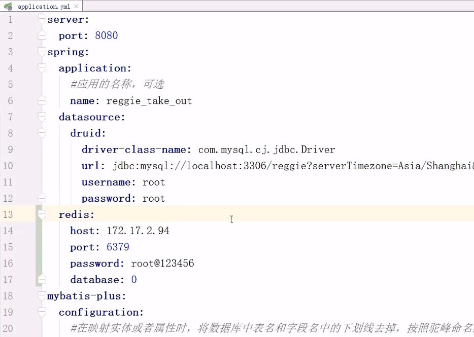
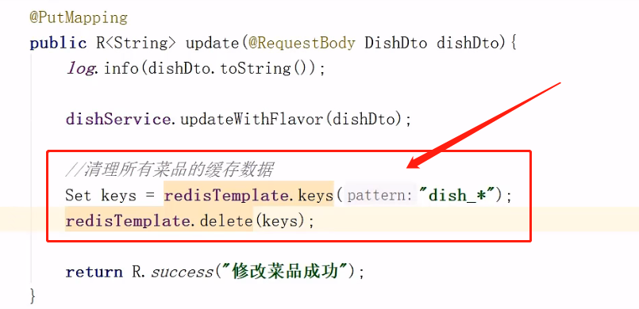
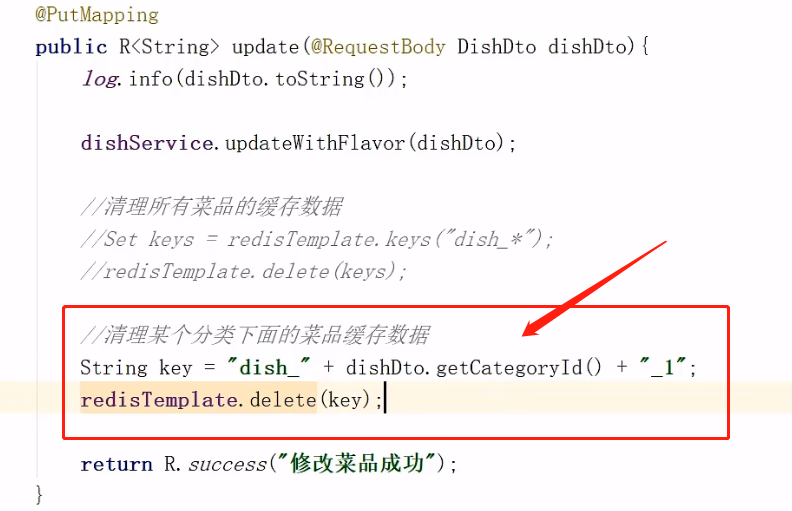
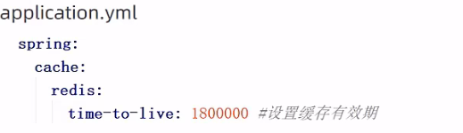

[toc]

# Java SpringBoot项目中 用Redis实现数据缓存

# 1 环境搭建

## 1.1 maven坐标

在项目的pom.xml文件中导入spring data redis的maven坐标：

```xml
<dependency>
    <groupId>org.springframework.boot</groupId>
    <artifactId>spring-boot-starter-data-redis</artifactId>
</dependency>
```


## 1.2 配置文件

在application.yml 中添加redis配置

```yaml
redis: 
    host: 172.17.2.94
    port: 6379
    password: root@123456
    database: 0
```



## 1.3 配置类

在项目中加入配置类RedisConfig：

```java
@Configuration 
public class RedisConfig extends CachingConfigurerSupport{
    @Bean
    public RedisTemplate<Object,Object> redisTemplate(RedisConnectionFactory connectionFactory){
        RedisTemplate<Object,Object> redisTemplate = new RedisTemplate<>();
    	//默认的Key序列化器为:JdkSerializationRedisSerializer 
        redisTemplate.setKeySerializer(new StringRedisSerializer());
        redisTemplate.setConnectionFactory(connectionFactory);
        return redisTemplate;	    
    } 
}
```


# 2 实现缓存短信验证码

**实现思路：**

在已经实现了移动端手机验证码登录的基础上，随机生成的验证码我们是保存在HttpSession中的。
现在需要改造为将验证码缓存在Redis中，具体的实现思路如下：

1. 在服务端UserController中**注入RedisTemplate对象**，用于操作Redis
2. 在服务端UserController的sendMsg方法中，将随机生成的验证码缓存到Redis中，并设置有效期为5分钟3、在服务端UserController的login方法中，从Redis中获取缓存的验证码，如果登录成功则删除Redis中的验证码

```java
//注入
@Autowired 
private RedisTemplate redisTemplate;

//缓存到redis
//将生成的验证码缓存到Redis中,并且设置有效期为5分钟
redisTemplate.opsForValue().set(phone,code,timeout:5,TimeUnit.MINUTES);

//从Redis中获取缓存的验证码
Object codeInSession = redisTemplate.opsForValue().get(phone);

//如果用户登录成功,删除Redis中缓存的验证码
redisTemplate.delete(phone);
```


# 3 缓存菜品数据

**实现思路：**

前面我们已经实现了移动端菜品查看功能，对应的服务端方法为DishController的list方法，此方法会根据前端提交的查询条件进行数据库查询操作。在高并发的情况下，频繁查询数据库会导致系统性能下降，服务端响应时间增长。现在需要对此方法进行缓存优化，提高系统的性能。
具体的实现思路如下：

1. 改造DishController的list方法，先从Redis中获取菜品数据，如果有则直接返回，无需查询数据库；如果没有则查询数据库，并将查询到的菜品数据放入Redis。
2. 改造DishController的save和update方法，加入清理缓存的逻辑

缓存实现：

```java
//动态构造key键
String key ="dish_" + dish.getCategoryId() + "_" + dish.getStatus();//dish_1397844391040167938_1
//先从redis中获取缓存数据
dishDtoList = (List<DishDto>)redisTemplate.opsForValue().get(key);

if(dishDtoList!= null){
	//如果存在,直接返回,无需查询数据库
	return R.success(dishDtoList);
}

//如果不存在，需要查询数据库，将查询到的菜品数据缓存到Redis

//查询操作。。。。

//存入缓存
redisTemplate.opsForValue().set(key, dishDtoList, timeout: 60, TimeUnit.MINUTEs) ;
```


*注意：*在使用缓存过程中，要注意保证数据库中的数据和缓存中的数据一致，**如果数据库中的数据发生变化，需要及时清理缓存数据**。

- 清理所有菜品数据缓存

  

- 清理对应分类下面的菜品缓存数据

  

  

# 4 Spring Cache 缓存框架

## 4.1 Spring Cache介绍

> Spring Cache是一个框架，实现了基于注解的缓存功能，只需要简单地加一个注解，就能实现缓存功能。
>
> Spring Cache提供了一层抽象，底层可以切换不同的cache实现。具体就是通过CacheManager接口来统一不同的缓存技术。

**CacheManager是Spring提供的各种缓存技术抽象接口。**

针对不同的缓存技术需要实现不同的CacheManager：

| CacheManager        | 描述                               |
| ------------------- | ---------------------------------- |
| EhCacheCacheManager | 使用EhCache作为缓存技术            |
| GuavaCacheManager   | 使用Google的GuavaCache作为缓存技术 |
| RedisCacheManager   | 使用Redis作为缓存技术              |


## 4.2 Spring Cache常用注解

| 注解             | 说明                                                         |
| ---------------- | ------------------------------------------------------------ |
| `@EnableCaching` | 开启缓存注解功能    (在启动类上)                             |
| `@Cacheable`     | 在方法执行前spring先查看缓存中是否有数据，如果有数据，则直接返回缓存数据；<br />若没有数据，调用方法并将方法返回值放到缓存中 |
| `@CachePut`      | 将方法的返回值放到缓存中                                     |
| `@CacheEvict`    | 将一条或多条数据从缓存中删除                                 |

在spring boot项目中，使用缓存技术只需在项目中导入相关缓存技术的依赖包，并在启动类上使用
`@EnableCaching`开启缓存支持即可。
例如，使用Redis作为缓存技术，只需要导入Spring data Redis的maven坐标即可。

## 4.3 Spring Cache使用方式

普通方式：

注入CacheManager

```java
@Autowired
private CacheManager accheManager;
```


- 开启并存储缓存

  ```java
  /**
  *CachePut:将方法返回值放入缓存
  *value：缓存的名称，每个缓存名称下面可以有多个key
  *key：缓存的key
  */
  @CachePut(value ="userCache",key ="#result.id")
  @PostMapping public User save(User user){
  	userService.save(user);
      return user;
  }
  ```

  

- 清理缓存

  ```java
  /**
  *CacheEvict:清理指定缓存
  *value:缓存的名称,每个缓存名称下面可以有多个key 
  *key:缓存的key
  */
  @CacheEvict(value ="userCache",key ="#p0")
  //@CacheEvict(value ="userCache",key ="#root.args[0]")
  //@CacheEvict(value ="userCache",key ="#id") （建议此种）
  @DeleteMapping("/{id}")
  public void delete(@PathVariable Long id){
  	userService.removeById(id);
  }
  ```


- 查询缓存

  ```java
  /**
  *Cacheable: 在方法执行前spring先查看缓存中是否有数据，如果有数据，则直接返回缓存数据；若没有数据，调用方法并将方法返回值放到缓存中
  *value: 缓存的名称,每个缓存名称下面可以有多个key 
  *key: 缓存的key
  *condition: 满足条件时缓存数据
  *unless: 满足条件则不缓存
  */
  @Cacheable(value = "userCache", key = "#id", condition = "#result != null")
  @GetMapping("/{id}")
  public User getById(@ PathVariable Long id) {
  	User user = userService. getById(id);
      return user;
  }
  ```

  

**使用Redis 缓存技术：**

1. 导入maven坐标
   spring-boot-starter-data-redis、spring-boot-starter-cache

2. 配置application.yml 

   spring: 	cache: 	redis:	time-to-live：1800000 #设置缓存有效期

   

3. 在启动类上加入@EnableCaching注解，开启缓存注解功能

4. 在Controller的方法上加入@Cacheable、@CacheEvict等注解，进行缓存操作

注意：

- condition 条件中 返回结果result 不可用，unless可用

  `unless = "#result == null"`

- 返回对象要实现序列化接口

  `public class R<T> implements Serializable{}`

- 删除某项所有缓存

  `@CacheEvict(value = "setmealCache", allEntries = true)`

  