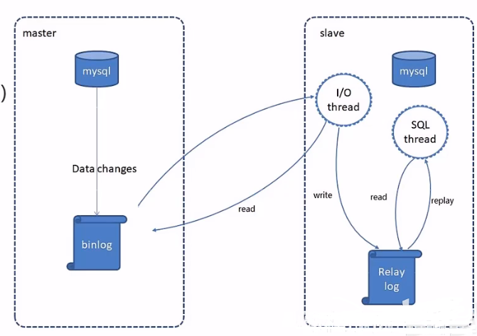
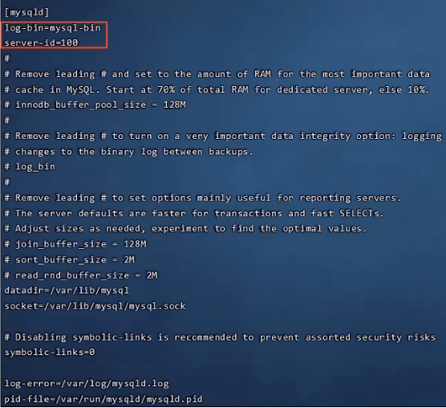
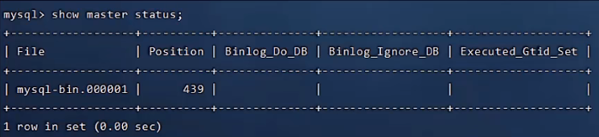
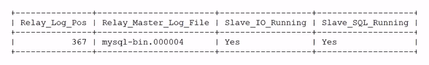
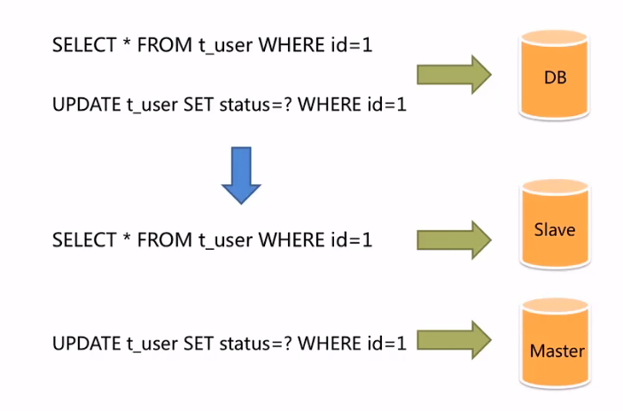

[toc]

# Java项目 读写分离技术

> 面对日益增加的系统访问量，数据库的吞吐量面临着巨大瓶颈。对于同一时刻有大量并发读操作和较少写操作类型的应用系统来说，将**数据库拆分为主库和从库**，**主库**负责处理事务性的**增删改操作**，**从库**负责处理**查询操作**，能够有效的避免由数据更新导致的行锁，使得整个系统的查询性能得到极大的改善。

# 1 Mysql 主从复制

## 1.1 介绍

MySQL主从复制是一个异步的复制过程，底层是基于Mysql数据库自带的**二进制日志**功能。就是**一台或多台MySQL数据库**（slave，即**从库**，可有多个）从另一台MySQL数据库（master，即**主库**）进行日志的复制然后再解析日志并应用到自身，最终实现**从库的数据和主库的数据保持一致**。MySQL主从复制是MySQL数据库自带功能，无需借助第三方工具。

  

**MySQL复制过程分成三步：**

1. master将改变记录到二进制日志（binary log）
2. slave将master的binary log拷贝到它的中继日志（relay log）
3. slave重做中继日志中的事件，将改变应用到自己的数据库中


## 1.2 配置

**前置条件：**

提前准备好**两台服务器**，分别安装Mysql并启动服务成功

- 主库Master 192.168.138.100
- 从库Slave 192.168.138.101

**主库配置步骤：**

1. 修改Mysql数据库的配置文件 /etc/my.cnf

   ```powershell
   [mysqld]
   log-bin=mysql-bin
   #[必须]启用二进制日志
   
   server-id=100
   #[必须]服务器唯一ID
   ```

   

2. 重启Mysql服务

   `systemctl restart mysqld`

3. 登录Mysql数据库，执行下面SQL

   ```sql
   GRANT REPLICATION SLAVE ON *.* to 'xiaoming'@'%' identified by 'Root@123456';
   ```

   注：上面SQL的作用是创建一个用户xiaoming，密码为Root@123456，并且给xiaoming用户授予REPLICATION SLAVE权限。常用于建立复制时所需要用到的用户权限，也就是slave必须被master授权具有该权限的用户，才能通过该用户复制。

4. 登录Mysql数据库，执行下面SQL，记录下结果中File和Position的值

   ```sql
   show master status;
   ```

   

   注：上面SQL的作用是查看Master的状态，执行完此SQL后不要再执行任何操作


**从库配置步骤：**

1. 修改Mysql数据库的配置文件 /etc/my.cnf

   ```powershell
   [mysqld]
   server-id=101
   #[必须]服务器唯一ID
   ```

   

2. 重启Mysql服务

   `systemctl restart mysqld`

3. 登录Mysql数据库，执行下面SQL，根据主库中的内容修改

   ```sql
   change master to 
   master_host='192.168.138.100', master_user='xiaoming', master_password='Root@123456', master_log_file='mysql-bin.000001', master_log_pos=439; 
   
   start slave;
   ```

   注：若因为slave线程已启动需先停止slave线程(`stop slave;`)才能执行成功上述sql语句。

4. 登录Mysq1数据库，执行下面SQL，查看从数据库的状态

   ```sql
   show slave status;
   ```

   


测试：

​	操作主库，查看从库是否有响应的内容变化。


# 2 读写分离实现

## 2.1 背景

面对日益增加的系统访问量，数据库的吞吐量面临着巨大瓶颈。对于同一时刻有大量并发读操作和较少写操作类型的应用系统来说，将数据库拆分为主库和从库，主库负责处理事务性的增删改操作，从库负责处理查询操作，能够有效的避免由数据更新导致的行锁，使得整个系统的查询性能得到极大的改善。




## 2.2 Sharding-JDBC 介绍

Sharding-JDBC定位为轻量级Java框架，在Java的JDBC层提供的额外服务。

它使用客户端直连数据库，以jar包形式提供服务，无需额外部署和依赖，可理解为增强版的JDBC驱动，完全兼容JDBC和各种ORM框架。

使用Sharding-JDBC可以在程序中轻松的实现数据库读写分离，**增删改操作自动修改主库，查询操作自动在从库中获取**。

- 适用于任何基于JDBC的ORM框架，如：JPA，Hibernate，Mybatis，Spring JDBC Template或直接使用JDBC。
- 支持任何第三方的数据库连接池，如：DBCP，C3PO，BoneCP，Druid，HikariCP等。
- 支持任意实现JDBC规范的数据库。目前支持MySQL，Oracle，SQLServer，PostgreSQL以及任何遵循SQL92标准的数据库。

maven坐标：

```xml
<dependency>
    <groupId>org.apache.shardingsphere</groupId>
    <artifactId>sharding-jdbc-spring-boot-starter</artifactId>
    <version>4.0.0-RC1</version>
<dependency>
```


## 2.3 配置步骤

使用Sharding-JDBC实现读写分离步骤（不需要修改Java代码，只需完成三步配置）：

1. 导入Sharding-JDBCd的maven坐标

2. 在配置文件中配置读写分离规则(application.yml配置文件)

3. 在配置文件中配置**允许bean定义覆盖**配置项

   ```yaml
   spring:
   	shardingsphere:
   		datasource:
   			names:
   				master,slave
   			#主数据源
   			master:
   				type: com.alibaba.druid.pool.DruidDataSource 
   				driver-class-name: com.mysql.cj.jdbc.Driver 
   				url: jdbc:mysql://192.168.138.100:3306/rw?characterEncoding=utf-8
   				username: root
   				password: root
               #从数据源
               slave:
               	type: com.alibaba.druid.pool.DruidDataSource 
               	driver-class-name: com.mysql.cj.jdbc.Driver 
               	url: jdbc:mysql://192.168.138.101:3306/rw?characterEncoding-utf-8
               	username: root
               	password: root
               masterslave:
                   #读写分离配置
                   load-balance-algorithm-type: round_robin
                   #最终的数据源名称
                   name: dataSource
                   #主库数据源名称
                   master-data-source-name: master
                   #从库数据源名称列表,多个逗号分隔
                   slave-data-source-names: slave 
               props:
               	sql:
               		show: true #开启sQL显示,默认false
       main:
       	allow-bean-definition-overriding: true #允许bean定义覆盖
   ```