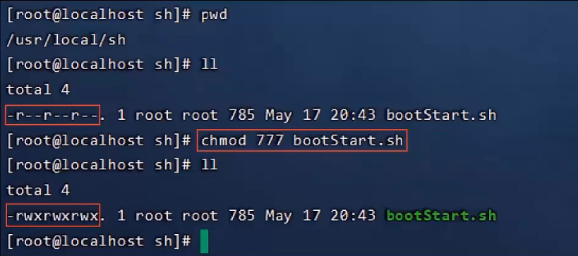

[toc]

# Linux 基础入门

# 1 Linux 简介

## 1.1不同应用领域的主流操作系统

- 桌面操作系统

1. Windows（用户数量最多）
2. Mac OS（操作体验好，办公人士首选）
3. Linux（用户数量少）

- 服务器操作系统

1. UNIX（安全、稳定、付费）
2. Linux（安全、稳定、免费、占有率高）
3. Windows Server（付费、占有率低）

- 移动设备操作系统

1. Android（基于Linux、开源，主要用于智能手机、平板电脑和智能电视）
2. iOS（苹果公司开发、不开源，用于苹果公司的产品，例如：iPhone、iPad）

- 嵌入式操作系统

1. Linux（机顶盒、路由器、交换机）


## 1.2 Linux发展历史与 Linux系统版本

时间：1991年
地点：芬兰赫尔辛基大学
人物：Linus Torvalds（21岁）
语言：C语言、汇编语言
logo：企鹅
**特点：免费、开源、多用户、多任务**


**Linux系统分为内核版和发行版**

- 内核版
  - 由Linus Torvalds及其团队开发、维护
  - 免费、开源
  - 负责控制硬件
- 发行版
  - 基于Linux内核版进行扩展
  - 由各个Linux厂商开发、维护
  - 有收费版本和免费版本

**Linux系统发行版：**

- Ubuntu：以桌面应用为主
- RedHat：应用最广泛、收费
- CentOS：RedHat的社区版、免费
- openSUSE：对个人完全免费、图形界面华丽
- Fedora：功能完备、快速更新、免费
- 红旗Linux：北京中科红旗软件技术有限公司开发


# 2 Linux 安装

## 2.1 安装方式介绍

- 物理机安装：直接将操作系统安装到服务器硬件上


- 虚拟机安装：通过虚拟机软件安装

虚拟机（Virtual Machine）指通过软件模拟的具有完整硬件系统功能、运行在完全隔离环境中的完整计算机系统。

*通过虚拟机软件来模拟计算机硬件*

**常用虚拟机软件：**

- ==VMWare==
- VirtualBox
- VMLite WorkStation
- Qemu
- HopeddotVoS


## 2.2 安装Linux


*`crtl + Alt`退出虚拟机界面*


## 2.3 网卡设置

由于启动服务器时未加载网卡，导致IP地址初始化失败


修改网络初始化配置，设定网卡在系统启动时初始化

```
cd /      			进入根目录
cd etc    			进入etc目录
cd sysconfig   		进入sysconfig目录
cd network-scripts 	进入network-scripts
vi ifcfg-ens33     	编辑ifcfg-ens33文件
i		 进入编辑状态
光标		移动光标
<ESC> -> :wq -> <ENTER> 保存退出
```


*然后重启服务器登录即可完成网络设置。*

## 2.4 安装SSH连接工具

SSH（Secure Shell），建立在应用层基础上的安全协议常用的SSH连接工具

- putty 
- secureCRT 
- xshell 
- ==finalshell==

**通过SSH连接工具就可以实现从本地连接到远程的Linux服务器**


# Linux和Windows目录结构对比

**Linux系统中的目录**

- `/`是所有目录的顶点
- 目录结构像一颗倒挂的树


**Linux目录介绍**

- bin 存放二进制可执行文件
- boot 存放系统引导时使用的各种文件
- dev 存放设备文件
- etc 存放系统配置文件
- home 存放系统用户的文件
- lib 存放程序运行所需的共享库和内核模块
- opt 额外安装的可选应用程序包所放置的位置
- root 超级用户目录
- sbin 存放二进制可执行文件，只有root用户才能访问
- tmp 存放临时文件
- usr 存放系统应用程序
- var 存放运行时需要改变数据的文件，例如日志文件


# 3 Linux 常用命令

## 3.1 Linux命令初体验


- `Tab`键自动补全
- 连续两次`Tab`键，给出操作提示
- 使用上下箭头快速调出曾经使用过的命令
- 使用`clear`命令或者`Ctrl+l`快捷键实现清屏

**Linux命令格式**

`command [-options] [parameter]`

说明：

- command：命令名
- [-options]：选项，可用来对命令进行控制，也可以省略
- [parameter]：传给命令的参数，可以是零个、一个或者多个

注意：
`[]`代表可选
==命令名、选项、参数之间有空格进行分隔==


## 3.2 文件目录操作命令

### `ls`

作用：显示指定目录下的内容
语法：`Is [-al] [dir]`
说明：

1. `-a`显示所有文件及目录（`.`开头的隐藏文件也会列出）
2. `-l` 除文件名称外，同时将文件型态（开头是`d`表示目录，`-`表示文件）、权限、拥有者、文件大小等信息详细列出

注意：
由于我们使用`ls`命令时经常需要加入`-l`选项，所以Linux为`ls -l`命令提供了一种简写方式，即`ll`


### `cd`

作用：用于切换当前工作目录，即进入指定目录

语法：`cd [dirName]`
特殊说明：

1. `~`表示用户的home目录
2. `.`表示目前所在的目录
3. `..`表示目前位置的上级目录

举例：

1. `cd ..`切换到当前目录的上级目录
2. `cd ~`切换到用户的home目录
3. `cd /usr/local`切换到/usr/local目录


### `cat`

作用：用于显示文件内容
语法：`cat[-n] fileName`
说明：

​	`-n`：由1开始对所有输出的行数编号

举例：

​	`cat /etc/profile`查看/etc目录下的profile文件内容


### `more`

作用：以分页的形式显示文件内容
语法：`more fileName`
操作说明：

1. `回车键`	向下滚动一行
2. `空格键`    向下滚动一屏
3. `b `            返回上一屏
4. `q`或者`Ctrl+C`    退出more

举例：
`more/etc/profile`        以分页方式显示 /etc 目录下的profile文件内容


###  `tail`

作用：查看文件末尾的内容
语法：`tail [-f] fileName`

说明：

​	`-f`：动态读取文件末尾内容并显示，通常用于日志文件的内容输出，`Ctrl+C`结束动态获取

举例：

1. `tail /etc/profile`显示/etc目录下的profile文件末尾10行的内容
2. `tail -20 /etc/profile`显示/etc目录下的profile文件末尾20行的内容
3. `tail -f /itcast/my.log`==动态读取/itcast目录下的`my.log`文件末尾内容并显示==


### `mkdir`

作用：创建目录
语法：`mkdir [-p] dirName`

说明：
	`-p`：确保目录名称存在，不存在的就创建一个。通过此选项，可以实现多层目录同时创建

举例：

1. `mkdir itcast `在当前目录下，建立一个名为itcast的子目录
2. `mkdir -p itcast/test` 在工作目录下的itcast目录中建立一个名为test的子目录，若itcast目录不存在，则建立一个


### `rmdir`

作用：删除空目录
语法：`rmdir [-p] dirName`

说明：
	`-p`：当子目录被删除后使父目录为空目录的话，则一并删除
举例：

1. `rmdir itcast` 删除名为itcast的空目录
2. `rmdir -p itcast/test`删除itcast目录中名为test的子目录，若test目录删除后itcast目录变为空目录，则也被删除
3. `rmdir itcast*`删除名称以itcast开始的空目录


### `rm`

作用：删除文件或者目录
语法：`rm [-rf] name`

说明：

1. `-r`：将目录及目录中所有文件（目录）逐一删除，即递归删除
2. `-f`：无需确认，直接删除

举例：

1. `rm -r itcast/`删除名为itcast的目录和目录中所有文件，删除前需确认
2. `rm -rf itcast/`无需确认，直接删除名为itcast的目录和目录中所有文件
3. `rm -f hello.txt` 无需确认，直接删除hello.txt文件

## 3.3拷贝移动命令

### `cp`

作用：用于复制文件或目录
语法：`cp [-r] source dest`

说明：
	`-r`：如果复制的是目录需要使用此选项，此时将复制该目录下所有的子目录和文件

举例：

1. `cp hello.txt itcast/`将hello.txt复制到itcast目录中
2. `cp hello.txt ./hi.txt`将hello.txt复制到当前目录，并改名为hi.txt 
3. `cp -r itcast/ ./itheima/`将*itcast目录和目录下*所有文件复制到itheima目录下
4. `cp -r itcast/* ./itheima/`将*itcast目录下*所有文件复制到itheima目录下


### `mv`

作用：为文件或目录改名、或将文件或目录移动到其它位置
语法：`mv source dest`

举例：

1. `mv hello.txt hi.txt`将hello.txt改名为hi.txt
2.  `mv hi.txt itheima/`将文件hi.txt移动到itheima目录中
3. `mv hi.txt itheima/hello.txt` 将hi.txt移动到itheima目录中，并改名为hello.txt
4. ` mv itcast/ itheima/`如果itheima目录不存在，将itcast目录改名为itheima 
5. `mv itcast/ itheima/`如果itheima目录存在，将itcast目录移动到itheima目录中


## 3.4打包压缩命令

### `tar`

作用：对文件进行打包、解包、压缩、解压
语法：`tar [-zcxvf] fileName [files]`

**包文件后缀为`.tar`表示只是完成了打包，并没有压缩**

**包文件后缀为`.tar.gz`表示打包的同时还进行了压缩**

说明：

1. `-z`：z代表的是gzip，通过gzip命令处理文件，gzip可以对文件压缩或者解压
2. `-c`：c代表的是create，即创建新的包文件
3. `-x`：x代表的是extract，实现从包文件中还原文件
4. `-v`：v代表的是verbose，显示命令的执行过程
5. `-f`：f代表的是file，用于指定包文件的名称

举例：

打包

1. `tar -cvf test.tar test` 表示对test目录下的文件打包成 test.tar 文件
2. `tar -zcvf hello.tar.gz ./*`将当前目录下所有文件打包并压缩，打包后的文件名为hello.tar.gz

解包

1. `tar -xvf hello.tar`将hello.tar文件进行解包，并将解包后的文件放在当前目录
2.  `tar -zxvf hello.tar.gz`将hello.tar.gz文件进行解压，并将解压后的文件放在当前目录
3. `tar -zxvf hello.tar.gz -C /usr/local`将hello.tar.gz文件进行解压，并将解压后的文件放在/usr/local目录


## 3.5文本编辑命令

### `vi`

作用：vi命令是Linux系统提供的一个文本编辑工具，可以对文件内容进行编辑，类似于Windows中的记事本

语法：`vi fileName`

说明：

1. vim 是从 vi 发展来的一个功能更加强大的文本编辑工具，在编辑文件时可以**对文本内容进行着色**，方便我们对文件进行编辑处理，所以实际工作中vim更加常用。
2. 要使用 vim 命令，需要我们自己完成安装。可以使用下面的命令来完成安装：
   `yum install vim`


### `vim`

作用：对文件内容进行编辑，vim其实就是一个文本编辑器
语法：`vim fileName`

说明：

1. 在使用vim命令编辑文件时，如果指定的文件存在则直接打开此文件。如果指定的文件*不存在则新建文件*。

2. vim在进行文本编辑时共分为三种模式:

   - 命令模式（Command mode）
   - 插入模式（Insert mode）
   - 底行模式（Last line mode）。

   这三种模式之间可以相互切换。我们在使用vim时一定要注意我们当前所处的是哪种模式。

**vim中三种模式说明：**

1. 命令模式
   - 命令模式下可以查看文件内容、移动光标（上下左右箭头、`gg`：定位到开头、`G`：定位到末尾）
   - 通过vim命令打开文件后，默认进入命令模式
   - 另外两种模式需要首先进入命令模式，才能进入彼此
2. 插入模式
   - 插入模式下可以对文件内容进行编辑
   - 在命令模式下按下[`i`，`a`，`o`]任意一个，可以进入插入模式。进入插入模式后，下方会出现【insert】字样
   - 在插入模式下按下ESC键，回到命令模式
3. 底行模式
   - 底行模式下可以通过命令对文件内容进行查找、显示行号、退出等操作
   - 在命令模式下按下[`:`，`/`]任意一个，可以进入底行模式
   - 通过 `/` 方式进入底行模式后，可以对文件内容进行查找
   - 通过 `:` 方式进入底行模式后，可以输入`wq`（保存并退出）、`q!`（不保存退出）、`set nu`（显示行号）


## 3.6查找命令

### `find`

作用：在**指定目录下**查找文件
语法：`find dirName -option fileName`
举例：

1. `find . -name "*.java"` 在当前目录及其子目录下查找`.java`结尾文件
2. `find /itcast -name "*.java"`在/itcast目录及其子目录下查找 `.java` 结尾的文件


### `grep`

作用：从**指定文件中**查找指定的文本内容
语法：`grep word fileName`
举例：

1. `grep Hello HelloWorld.java` 查找HelloWorld.java文件中出现的Hello字符串的位置
2. `grep hello *.java` 查找当前目录中所有.java结尾的文件中包含hello字符串的位置


# 4 Linux 软件安装

### 4.1 软件安装方式

- **二进制发布包安装**
  软件已经针对具体平台编译打包发布，只要解压，修改配置即可
- **`rpm`安装**
  软件已经按照redhat的包管理规范进行打包(.rpm文件)，使用`rpm`命令进行安装，不能自行解决库依赖问题
- **`yum`安装**
  一种**在线软件安装**方式，本质上还是`rpm`安装，自动下载安装包并安装，安装过程中自动解决库依赖问题
- **源码编译安装**
  软件以源码工程的形式发布，需要自己编译打包


### 4.2 安装jdk

操作步骤：

1. 使用FinalShell自带的上传工具将jdk的二进制发布包上传到Linux （jdk-8u171-linux-x64.tar.gz）

2. 解压安装包，命令为`tar -zxvf jdk-8u171-linux-x64.tar.gz -C /usr/local`

3. 配置环境变量，使用vim命令修改/etc/profile文件，在文件末尾加入如下配置
	
	```powershell
	JAVA_HOME=/usr/local/jdk1.8.0_171
	PATH=$JAVA_HOME/bin：$PATH
	```
	
4. 重新加载profile文件，使更改的配置立即生效，命令为`source /etc/profile`

5. 检查安装是否成功，命令为`java -version`


### 4.3 安装Tomcat

操作步骤：

1. 使用FinalShell自带的上传工具将Tomcat的二进制发布包上传到Linux  (apache-tomcat-7.0.57.tar.gz)
2. 解压安装包，命令为`tar -zxvf apache-tomcat-7.0.57.tar.gz -C /usr/local`
3. 进入Tomcat的`bin`目录启动服务，命令为`sh startup.sh`或者`./startup.sh`

**验证Tomcat启动是否成功，有多种方式：**

- 查看启动日志
  `more /usr/local/apache-tomcat-7.0.57/logs/catalina.out` 

  `tail -50 /usr/local/apache-tomcat-7.0.57/logs/catalina.out`

- 查看进程 `ps -ef | grep tomcat`


*注意：*

1. `ps`命令是linux下非常强大的进程查看命令，通过`ps -ef`可以查看当前运行的所有进程的详细信息
2. `|`在Linux中称为管道符，可以将前一个命令的结果输出给后一个命令作为输入
3. 使用`ps`命令查看进程时，经常配合管道符和查找命令`grep`一起使用，来查看特定进程

**停止Tomcat服务的方式：**

1. 运行Tomcat的bin目录中提供的停止服务的脚本文件(shutdown.sh) 	(推荐使用)

   ```powershell
   sh shutdown.sh
   #或者
   ./shutdown.sh		
   ```

2. 结束Tomcat进程
   查看Tomcat进程`ps -ef | grep tomcat`，获得进程id

   

   执行命令结束进程`kill -9 114780`

*注意：*
`kill`命令是Linux提供的用于结束进程的命令，`-9`表示强制结束


### 4.4 安装MySQL

> *RPM（Red-Hat Package Manager）RPM软件包管理器，是红帽Linux用于管理和安装软件的工具*

操作步骤：

1. 检测当前系统中是否安装MySQL数据库

```powershell
rpm -qa
#查询当前系统中安装的所有软件

rpm -qa | grep mysql
#查询当前系统中安装的名称带mysql的软件

rpm -qa | grep mariadb
#查询当前系统中安装的名称带mariadb的软件
```

*注意：*

​		如果当前系统中已经安装有MySQL数据库，安装将失败。**CentOS7自带mariadb，与MySQL数据库冲突**

2. 卸载已经安装的冲突软件

   ```powershell
   rpm -e --nodeps 软件名称
   # 卸载软件
   rpm -e --nodeps mariadb-libs-5.5.60-1.el7_5.x86_64
   ```

3. 将资料中提供的MySQL安装包上传到Linux并解压

   ```powershell
   mkdir /usr/local/mysql
   tar -zxvf mysql-5.7.25-1.el7.x86_64.rpm-bundle.tar.gz -C /usr/local/mysql
   ```

   

   *说明：解压后得到6个rpm的安装包文件*

4. 按照顺序安装rpm软件包

   ```powershell
   rpm -ivh mysql-community-common-5.7.25-1.el7.x86_64.rpm
   rpm -ivh mysql-community-libs-5.7.25-1.el7.x86_64.rpm
   rpm -ivh mysql-community-devel-5.7.25-1.el7.x86_64.rpm
   rpm -ivh mysql-community-libs-compat-5.7.25-1.el7.x86_64.rpm
   rpm -ivh mysql-community-client-5.7.25-1.el7.x86_64.rpm
   yum install net-tools
   rpm -ivh mysql-community-server-5.7.25-1.el7.x86_64.rpm
   ```

   说明1：安装过程中提示缺少net-tools依赖，使用yum安装

   说明2：可以通过指令升级现有软件及系统内核 `yum update`

   说明3：mysql8及以上版本不适用

5. 启动mysql

   ```powershell
   systemctl status mysqld
   #查看mysql服务状态
   
   systemctl start mysqld
   #启动mysql服务
   
   # 可以设置开机时启动mysql服务，避免每次开机启动mysql
   systemctl enable mysqld
   #开机启动mysql服务
   
   netstat -tunlp
   #查看已经启动的服务
   
   netstat -tunlp | grep mysql
   #查看mysql是否已经启动的服务
   
   ps-ef | grep mysql
   #查看mysql进程
   ```

6. 登录MySQL数据库，查阅临时密码

   ```powershell
   cat /var/log/mysqld.log
   #查看文件内容
   
   cat /var/log/mysqld.log | grep password
   #查看文件内容中包含password的行信息
   ```

   

   *注意：*冒号后面的是密码，注意空格

7. 登录MySQL，修改密码，开放访问权限

   ```sql
   mysal -uroot -p								登录mysql（使用临时密码登录）
   #修改密码
   set global validate_password_length=4;		设置密码长度最低位数
   set global validate_password_policy=LOW;	设置密码安全等级低，便于密码可以修改成root
   set password = password('root');			设置密码为root
   #开启访问权限
   grant all on *.* to 'root'@'%' identified by'root';
   flush privileges;
   ```

8. 测试MySQL数据库是否正常工作

   `show databases;`


### 4.5 安装Irzsz (用于文件上传与下载)

> *Yum（全称为Yellow dog Updater，Modified）是一个在Fedora和RedHat以及CentoS中的Shell前端软件包管理器。**基于RPM包管理**，能够从指定的服务器自动下载RPM包并且安装，可以自动处理依赖关系，并且一次安装所有依赖的软件包，无须繁琐地一次次下载、安装。*

操作步骤：

1. 搜索Irzsz安装包，命令为`yum list lrzsz`
2. 使用`yum`命令在线安装，命令为`yum install lrzsz.x86_64`

使用`rz`命令，可以选择文件上传到Linux服务器。


# Linux 防火墙 操作

防火墙操作：

- 查看防火墙状态（`systemctl status firewalld`、`firewall-cmd --state`）
- 暂时关闭防火墙（`systemctl stop firewalld`）
- 永久关闭防火墙（`systemctl disable firewalld`）
- 开启防火墙（`systemctl start firewalld`）
- 开放指定端口（`firewall-cmd --zone = public --add-port = 8080/tcp --permanent`）
- 关闭指定端口（`firewall-cmd --zone = public --remove-port = 8080/tcp --permanent`）
- 立即生效（`firewall-cmd --reload`）
- 查看开放的端口（`firewall-cmd --zone = public --list-ports`）

*注意：*

1. `systemctl`是管理Linux中服务的命令，可以对服务进行启动、停止、重启、查看状态等操作
2. `firewall-cmd`是Linux中专门用于控制防火墙的命令
3. 为了保证系统安全，服务器的防火墙不建议关闭


# 5 项目部署

## 5.1 手工部署项目

操作步骤：

1. 在IDEA中开发SpringBoot项目并打成jar包

   

2. 将jar包上传到Linux服务器

   `mkdir/usr/local/app` 创建目录，将项目jar包放到此目录

   

3. 启动SpringBoot程序 

   `java -jar helloworld-1.0-SNAPSHOT.jar`

   

4. 检查防火墙，确保8080端口对外开放，访问SpringBoot项目

5. 浏览器即可访问响应地址

   

6. 改为后台运行SpringBoot程序，并将日志输出到日志文件

   `nohup java -jar helloworld-1.0-SNAPSHOT.jar &> hello.log &`

**目前程序运行的问题：**

- 线上程序不会采用控制台霸屏的形式运行程序，而是将程序在后台运行；

- 线上程序不会将日志输出到控制台，而是输出到日志文件，方便运维查阅信息。

  ```powershell
  nohup 命令：英文全称 no hang up（不挂起），用于不挂断地运行指定命令，退出终端不会影响程序的运行
  语法格式：nohup Command [Arg...][&]
  参数说明：
  Command：要执行的命令
  Arg：一些参数，可以指定输出文件
  &：让命令在后台运行
  举例：
  nohup java -jar boot工程.jar &> hello.log &
  #后台运行java-jar命令，并将日志输出到hello.log文件
  ```

7. 停止SpringBoot程序

   ```powershell
   ps -ef | grep 'java -jar'
   kill -9 进程号
   ```


## 5.2 通过Shell脚本自动部署项目

操作步骤：

1. 在Linux中安装Git
2. 在Linux中安装maven
3. 编写Shell脚本（拉取代码、编译、打包、启动）
4. 为用户授予执行Shell脚本的权限
5. 执行Shell脚本


1. 在Linux中安装Git

   `yum list git`列出git安装包
   `yum install git`在线安装git

2. 使用Git克隆代码

   ```powershell
   cd /usr/local/
   git clone https://gitee.com/.....
   ```

3. 将资料中提供的maven安装包上传到Linux，在Linux中安装maven

   ```powershell
   tar -zxvf apache-maven-3.5.4-bin.tar.gz -C /usr/local 
   vim /etc/profile					# 修改配置文件，加入如下内容
   export MAVEN_HOME=/usr/local/apache-maven-3.5.4
   export PATH=$JAVA_HOME/bin:$MAVEN_HOME/bin:$PATH
   
   source/etc/profile
   mvn -version
   
   vim /usr/local/apache-maven-3.5.4/conf/settings.xml			# 设置maven本地仓库，修改配置文件内容如下
   <localRepository>/usr/local/repo</localRepository>
   ```

4. 将资料中提供的 Shell 脚本文件复制到Linux (bootStart.sh)Shell脚本（shell script），是一种Linux系统中的脚本程序。

   > 使用Shell脚本编程跟JavaScript、Java编程一样，只要有一个能编写代码的文本编辑器和一个能解释执行的脚本解释器就可以了。
   > 对于Shell脚本编写不作为本课程重点内容，直接使用课程资料中提供的脚本文件bootStart.sh即可。

   ```sh
   #!/bin/sh
   echo =================================
   echo  自动化部署脚本启动
   echo =================================
   
   echo 停止原来运行中的工程
   APP_NAME=reggie_take_out(名字需要根据情况改动)
   
   tpid=`ps -ef|grep $APP_NAME|grep -v grep|grep -v kill|awk '{print $2}'`
   if [ ${tpid} ]; then
       echo 'Stop Process...'
       kill -15 $tpid
   fi
   sleep 2
   tpid=`ps -ef|grep $APP_NAME|grep -v grep|grep -v kill|awk '{print $2}'`
   if [ ${tpid} ]; then
       echo 'Kill Process!'
       kill -9 $tpid
   else
       echo 'Stop Success!'
   fi
   
   echo 准备从Git仓库拉取最新代码(名字需要根据情况改动)
   cd /usr/local/javaapp/reggie_take_out
   
   echo 开始从Git仓库拉取最新代码
   git pull
   echo 代码拉取完成
   
   echo 开始打包
   output=`mvn clean package -Dmaven.test.skip=true`
   
   cd target
   
   echo 启动项目 (名字需要根据情况改动)
   nohup java -jar reggie_take_out-1.0-SNAPSHOT.jar &> reggie_take_out.log &
   echo 项目启动完成
   ```

5. 为用户授权

   > chmod（英文全拼：change mode）命令是控制用户对文件的权限的命令
   >
   > Linux中的权限分为：读（r）、写（w）、执行（×）三种权限
   >
   > Linux的文件调用权限分为三级：文件所有者（Owner）、用户组（Group）、其它用户（Other Users）
   > 只有文件的所有者和超级用户可以修改文件或目录的权限
   > 要执行Shell脚本需要有对此脚本文件的执行权限，如果没有则不能执行

   通过 `ll`命令查看响应文件的权限


​	**chmod命令可以使用八进制数来指定权限**




6. 执行脚本

   `./bootStart.sh`


7. 设置静态ip （软件上线时需要）

   修改文件/etc/sysconfig/network-scripts/ifcfg-ens33，(文件名字可能不同)内容如下：

   ```powershell
   TYPE="Ethernet"
   PROXY_METHOD="none"
   BROWSER_ONLY="no"
   BOOTPROTO=static			#使用静态IP地址，默认为dhep 
   IPADDR="192.168.138.100"	#设置的静态IP地址
   NETMASK="255.255.255.0"		#子网掩码
   GATEWAY="192.168.138.2"		#网关地址
   DNS1="192.168.138.2"		#DNS服务器
   DEFROUTE="yes"
   IPV4_FAILURE_FATAL="no"
   IPV6INIT="yes"
   IPV6_AUTOCONF="yes"IPV6_DEFROUTE="yes"
   IPV6_FAILURE_FATAL="no"
   IPV6_ADDR_GEN_MODE="stable-privacy"
   NAME="ens33"
   UUID="95b614cd-79b0-4755-b08d-99f1cca7271b"
   DEVICE="ens33"
   ONBOOT="yes"				#是否开机启用
   ```

   VMare工具栏编辑--> 虚拟网络编辑器

   


> 资料来源：[黑马程序员-瑞吉外卖-Linux课程_哔哩哔哩_bilibili](https://www.bilibili.com/video/BV13a411q753?p=118&vd_source=817119647dd4820bfbb8128007f410e6)