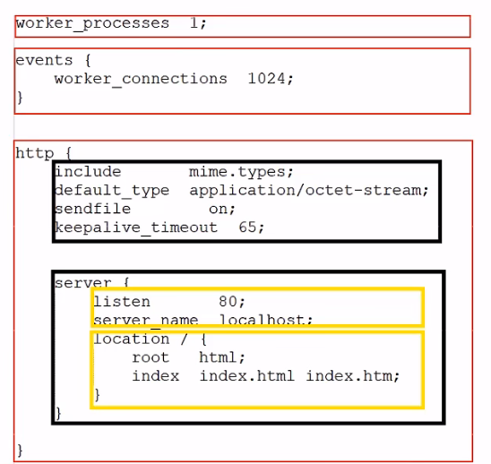

[toc]

# Nginx基础与应用

# 1 Nginx 概述

## 1.1 介绍

Nginx是一款轻量级的**web服务器**/**反向代理服务器**及**电子邮件（IMAP/POP3）代理服务器**。其特点是**占有内存少**，**并发能力强**，事实上nginx的并发能力在同类型的网页服务器中表现较好，中国大陆使用nginx的网站有：百度、京东、新浪、网易、腾讯、淘宝等。

Nginx是由伊戈尔·赛索耶夫为俄罗斯访问量第二的Rambler.ru站点（俄文：PaM6nep）开发的，第一个公开版本0.1.0发布于2004年10月4日。

官网：https://nginx.org/


## 1.2 下载与安装

可以到Nginx官方网站下载Nginx的安装包，地址为：https://nginx.org/en/download.html，点击即可下载。


安装过程：

1. 安装依赖包 `yum -y install gcc pcre-devel zlib-devel openssl openssl-devel`

2. Linux中下载Nginx安装包 `wget https://nginx.org/download/nginx-1.16.1.tar.gz`

   若不存在`wget`命令需进行安装`yum install wget`；或者在windows系统中下载，上传到Linux系统中

3. 解压 `tar -zxvf nginx-1.16.1.tar.gz`

4. 进入解压文件`cd nginx-1.16.1`

5. 配置 安装到指定文件目录中`./configure --prefix=/usr/local/nginx`

6. 编译及安装`make && make install`

## 1.3 目录结构

重点目录/文件：

- conf/nginx.conf		nginx配置文件
- html							存放静态文件（html、css、Js等）
- logs							日志目录，存放日志文件
- sbin/nginx				二进制文件，用于启动、停止Nginx服务


# 2 Nginx 命令

- 查看版本

  在nginx/sbin目录下执行`./nginx -v`

- 检查配置文件正确性

  在启动Nginx服务之前，可以先检查一下conf/nginx.conf文件配置的是否有错误，命令如下：
  在nginx/sbin目录下执行`./nginx -t`

- 启动与停止

  1. 启动Nginx服务使用如下命令：
     `./nginx`
  2. 停止Nginx服务使用如下命令：
     `./nginx -s stop`
  3. 启动完成后可以查看Nginx进程：
     `ps -ef | grep nginx`

- 重新加载配置文件

  `./nginx -s reload`

简化命令操作，将usr/local/nginx/sbin添加为环境变量：

```powershell
-vim /etc/profile

# 追加系统路径环境变量
PATH = /uer/local/nginx/sbin:

source /etc/profile

# 之后即可在任何目录执行nginx命令
nginx -s reload
```


#  3 Nginx 配置文件结构

Nginx配置文件（conf/nginx.conf）整体分为三部分：

- 全局块

  和Nginx运行相关的全局配置

- events块

  和网络连接相关的配置

- **http块**

  代理、缓存、日志记录、虚拟主机配置

  - http全局块
  - ==Server块==(可有多个)
    - Server全局块
    - location块（可有多个）



> 注意：http块中可以配置多个Server块，每个Server块中可以配置多个location块。


# 4 Nginx 具体应用

## 4.1 部署静态资源

Nginx可以作为**静态web服务器**来部署静态资源。静态资源指在服务端真实存在并且能够直接展示的一些文件，

比如常见的**html页面、css文件、js文件、图片、视频等**资源。

相对于Tomcat，Nginx处理静态资源的能力**更加高效**，所以在生产环境下，一般都会将静态资源部署到Nginx中。

将静态资源部署到Nginx非常简单，只需要将**文件复制到Nginx安装目录下的html目录**中即可。

**nginx.conf配置文件设置：**

```nginx
server{
    listen 80;  #监听端口
    server_name localhost; #服务器名称
    location / {  #匹配客户端请求url 
        root html;  #指定静态资源根目录
        index index.html index.htm;  #指定默认首页
    }
} 
```


## 4.2 反向代理

- 正向代理
  是一个位于客户端和原始服务器（origin server）之间的服务器，为了从原始服务器取得内容，客户端向代理发送一个请求并指定目标（原始服务器），然后代理向原始服务器转交请求并将获得的内容返回给客户端。

  正向代理的典型用途是为在防火墙内的局域网客户端提供访问Internet的途径。

  正向代理一般是**在客户端设置代理服务器**，通过代理服务器转发请求，最终访问到目标服务器。

  

- 反向代理
  反向代理服务器位于用户与目标服务器之间，但是对于用户而言，反向代理服务器就相当于目标服务器，即用户直接访问反向代理服务器就可以获得目标服务器的资源，反向代理服务器负责将请求转发给目标服务器。

  **用户不需要知道目标服务器的地址，也无须在用户端作任何设定。**(多用户统一访问入口)

  

- **配置反向代理**

  ```nginx
  server {
  	listen 82;
  	server_name localhost;
      location / {
          proxy-pass http://192.168.138.101:8080; #反向代理配置,将请求转发到指定服务
  	}
      
      location ^~ /api/ {
        # url重写 "/api/employ/login" -> "/employ/login"
          rewrite ^/api/(.*)$ /$1 break;
          proxy_pass http://192.168.138.101:8080; #反向代理配置,将请求转发到指定服务
      }
  }
  ```
  
  


## 4.3 负载均衡(基于反向代理实现)

早期的网站流量和业务功能都比较简单，单台服务器就可以满足基本需求，但是随着互联网的发展，业务流量越来越大并且业务逻辑也越来越复杂，单台服务器的性能及单点故障问题就凸显出来了，因此**需要多台服务器组成应用集群**，进行性能的水平扩展以及**避免单点故障出现**。

- 应用集群：将同一应用部署到多台机器上，组成应用集群，接收负载均衡器分发的请求，进行业务处理并返回响应数据
- 负载均衡器：将用户请求根据对应的负载均衡算法分发到应用集群中的一台服务器进行处理


**配置负载均衡：**

```nginx
upstream targetserver{	#upstream指令可以定义一组服务器
    server 192.168.138.101:8080;
    server 192.168.138.101:8081;
}
server{
    listen 8080;
    server_name localhost; #192.168.138.100
    location / {
		proxy_pass http://targetserver;
    }
}
```


**负载均衡策略：**

| 名称       | 说明                 |
| ---------- | -------------------- |
| 轮询       | 默认方式，依次轮回   |
| weight     | 权重方式，按比例执行 |
| ip_hash    | 依据ip分配方式       |
| least_conn | 依据最少连接方式     |
| url_hash   | 依据url分配方式      |
| fair       | 依据响应时间方式     |


```nginx
upstream targetserver{	#upstream指令可以定义一组服务器
    # 权重
    server 192.168.138.101:8080 weight=10;
    server 192.168.138.101:8081 weight=5;
}
```


