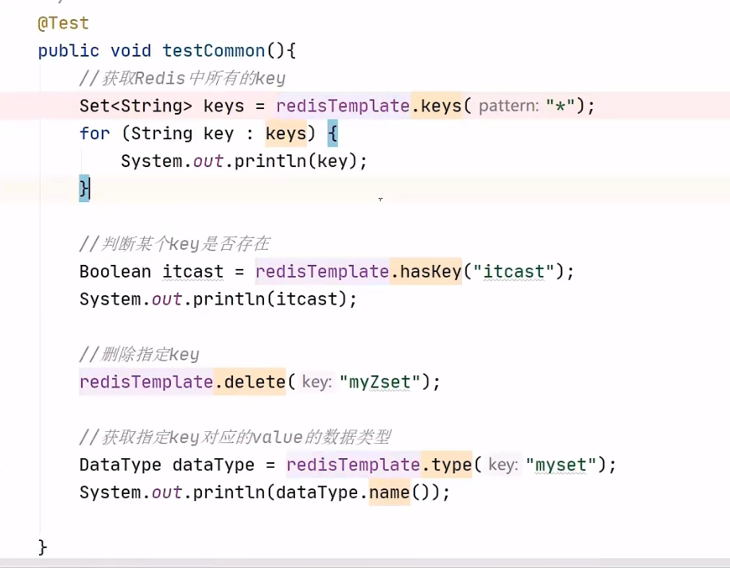

[toc]

# Redis 基础及在 Java 中的应用

# 1 Redis 入门

## 1.1 Redis 简介

> Redis is an open source（BSD licensed），in-memory data structure store，used as a database，cache，and message broker，
>
> 翻译为：Redis是一个开源的内存中的数据结构存储系统，它可以用作：数据库、缓存和消息中间件。
>
> 官网：https://redis.io
>
> **Redis是一个基于内存的key-value结构数据库。**
>
> - 基于内存存储，读写性能高
> - 适合存储热点数据（热点商品、资讯、新闻）

Redis是用C语言开发的一个开源的高性能键值对（key-value）数据库，官方提供的数据是可以达到100000+的QPS（每秒内查询次数）。它存储的value类型比较丰富，也被称为**结构化的NoSql数据库**。

>  NoSql（Not Only SQL），不仅仅是SQL，泛指非关系型数据库。NoSql数据库并不是要取代关系型数据库，而是关系型数据库的补充。

| **关系型数据库（RDBMS）** | **非关系型数据库（NoSql）** |
| :-----------------------: | :-------------------------: |
|           Mysql           |            Redis            |
|          Oracle           |          Mongo db           |
|            DB2            |          MemCached          |
|         SQLServer         |                             |

**Redis应用场景**

- 缓存
- 任务队列
- 消息队列
- 分布式锁


## 1.2 Redis 下载与安装

Redis安装包分为windows版和Linux版：

- Windows版下载地址：https://github.com/microsoftarchive/redis/releases
- Linux版下载地址：https://download.redis.io/releases/

**在Linux系统安装Redis步骤：**

1. 将Redis安装包上传到Linux
2. 解压安装包，命令：`tar -zxvf redis-4.0.0.tar.gz -C /usr/local`
3. 安装Redis的依赖环境gcc，命令：`yum install gcc-c++`
4. 进入/usr/local/redis-4.0.0，进行编译，命令：`make`
5. 进入redis的src目录，进行安装，命令：`make install`

**Redis的Windows版属于绿色软件，直接解压即可使用，解压后目录结构如下：**


## 1.3 Redis服务启动与停止

  Linux中redis服务启动，直接执行redis-server文件即可，默认端口号为6379

命令：`./redis-server`


执行redis-cli文件，即可连接redis服务。

命令：`./redis-cli`


停止Redis服务：快捷键：`Ctrl + C`

将Redis服务改为启动后台运行，需要修改redis.conf配置文件

```powershell
vim redis.conf

# 查找dae
/dae

#进入插入模式，修改daemonize 为 yes
daemonize no -->daemonize yes

# 加载配置文件，启动redis服务(后台运行)
src/redis-server ./redis.conf
```

Windows系统中启动Redis，直接双击redis-server.exe即可启动Redis服务，redis服务默认端口号为6379

**配置密码校验：**

```powershell
vim redis.conf

# 查找
/pass

# 取消requirepass 注释，并更改密码
requirepass 123456

# 加载配置文件，启动redis服务(后台运行)
src/redis-server ./redis.conf

# 客户端本地登录连接
src/redis-cli -h localhost -p 6379
auth 123456  #认证

# 或者
src/redis-cli -h localhost -p 6379 -a 123456
```

**开启远程连接：**

redis.conf文件中注释`bind 127.0.0.1`

```powershell
vim redis.conf

# 查找
/bind
# 将 bind 127.0.0.1 注释掉
bind 127.0.0.1
```

*注意：*远程连接要开放防火墙端口


# 2 数据类型

## 2.1 介绍

Redis存储的是key-value结构的数据，其中**key是字符串类型，value有5种常用的数据类型**：

- 字符串 string
- 哈希 hash
- 列表 list
- 集合 set
- 有序集合 sorted set


## 2.2 五种常用数据类型


# 3 常用命令

> 更多命令可以参考Redis中文网：https://www.redis.net.cn

## 3.1 字符串 string 操作命令

- `SET key value`设置指定key的值
- `GET key`获取指定key的值
- `SETEX key seconds value` 设置指定key的值，并将 key 的过期时间设为 seconds 秒
- `SETNX key value`只有在 key 不存在时设置 key 的值


## 3.2 哈希 hash 操作命令

Redis hash是一个string类型的field和value的映射表，hash特别适合用于存储对象。


常用命令：

- `HSET key field value` 将哈希表 key 中的字段 field 的值设为 value
- `HGET key field` 获取存储在哈希表中指定字段的值
- `HDEL key field` 删除存储在哈希表中的指定字段
- `HKEYS key` 获取哈希表中所有字段
- `HVALS key` 获取哈希表中所有值
- `HGETALL key` 获取在哈希表中指定 key 的所有字段和值


## 3.3 列表 list 操作命令

Redis 列表是简单的字符串列表，按照插入顺序排序，常用命令：

- `LPUSH key value1 [value2] `将一个或多个值插入到列表头部
- `LRANGE key start stop `获取列表指定范围内的元素， *(0, -1)表示全部*
- `RPOP key ` 移除并获取列表最后一个元素
- `LLEN key` 获取列表长度
- `BRPOP key1 [key2] timeout` 移出并获取列表的最后一个元素，如果列表没有元素会阻塞列表直到等待超时或发现可弹出元素为止


## 3.4 集合 set 操作命令

Redis set 是string类型的无序集合。集合成员是唯一的，这就意味着集合中不能出现重复的数据，常用命令：

- `SADD key member1 [member2]`向集合添加一个或多个成员
- `SMEMBERS key`返回集合中的所有成员
- `SCARD key`获取集合的成员数
- `SINTER key1 [key2]`返回给定所有集合的交集
- `SUNION key1 [key2]`返回所有给定集合的并集
- `SDIFF key1 [key2]`返回给定所有集合的差集(key1中存在，key2中不存在的元素)
- `SREM key member1 [member2]`移除集合中一个或多个成员


## 3.5 有序集合 sorted set 操作命令

Redis sorted set有序集合是string类型元素的集合，且不允许重复的成员。每个元素都会关联一个double类型的分数
（score）。redis正是通过分数来为集合中的成员进行从小到大排序。有序集合的成员是唯一的，但分数却可以重复。
常用命令：

- `ZADD key score1 member1 [score2 member2]`向有序集合添加一个或多个成员，或者更新已存在成员的分数
- `ZRANGE key start stop [WITHSCORES]`通过索引区间返回有序集合中指定区间内的成员,WITHSCORES表示同时显示分数
- `ZINCRBY key increment member`有序集合中对指定成员的分数加上增量 increment
- `ZREM key member [member...]`移除有序集合中的一个或多个成员


## 3.6 通用命令

- `KEYS pattern`查找所有符合给定模式（pattern）的key ,常用`keys *` 查询所有的键
- `EXISTS key`检查给定 key 是否存在
- `TYPE key`返回 key 所储存的值的类型
- `TTL key`返回给定 key 的剩余生存时间（TTL，time to live），以秒为单位
- `DEL key`该命令用于在key存在是删除 key


# 4 在Java 中操作Redis

## 4.1 介绍

Redis 的 Java 客户端很多，官方推荐的有三种：

- Jedis
-  Lettuce 
- Redisson 

Spring对Redis客户端进行了整合，提供了Spring Data Redis，在Spring Boot项目中还提供了对应的Starter，即**spring-boot-starter-data-redis**


## 4.2 Jedis

Jedis的maven坐标：

```xml
<dependency>
    <groupId>redis.clients</groupId>
    <artifactId>jedis</artifactId>
    <version>2.8.0</version>
</dependency>
```

**使用Jedis操作Redis的步骤：**

1. 获取连接
2. 执行操作
3. 关闭连接


## 4.3 Spring Data Redis **

在Spring Boot 项目中，可以使用Spring Data Redis来简化Redis操作，maven坐标：

```xml
<dependency>
    <groupId>org.springframework.boot</groupId>
    <artifactId>spring-boot-starter-data-redis</artifactId>
</dependency>
```

Spring Data Redis中提供了一个高度封装的类：RedisTemplate，针对jedis客户端中大量api进行了归类封装，将同一类型操作封装为operation接口，

具体分类如下：

- ValueOperations：简单K-V操作
- etOperations：set类型数据操作
- ZSetOperations：zset类型数据操作
- HashOperations：针对map类型的数据操作
- ListOperations：针对list类型的数据操作

配置文件设置：


配置类（更换序列化器）：


通用命令操作：




> 资料来源：[【黑马程序员-瑞吉外卖Redis课程】](https://www.bilibili.com/video/BV13a411q753?p=142&vd_source=817119647dd4820bfbb8128007f410e6)

