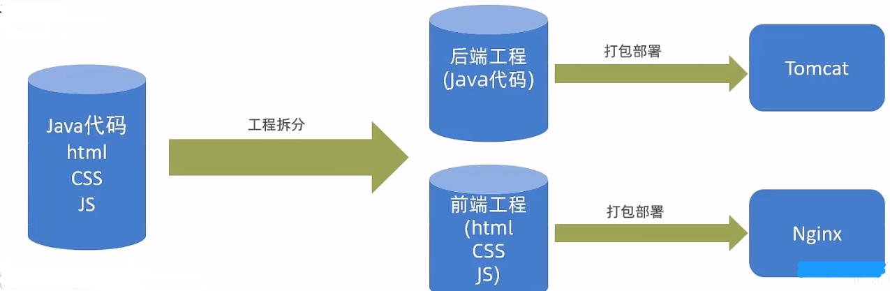
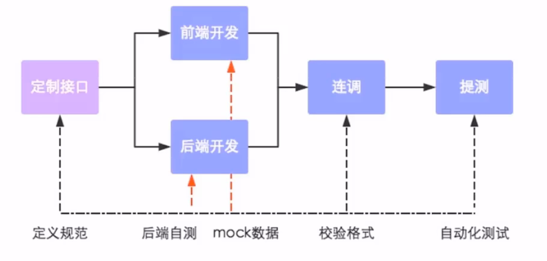
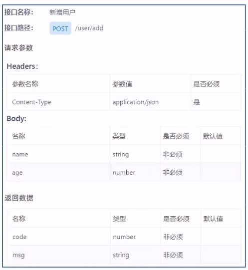
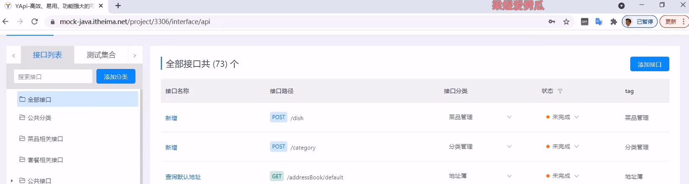
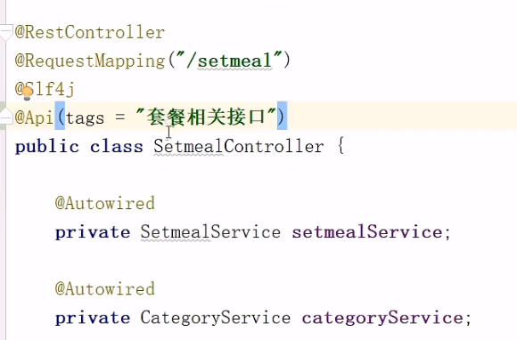
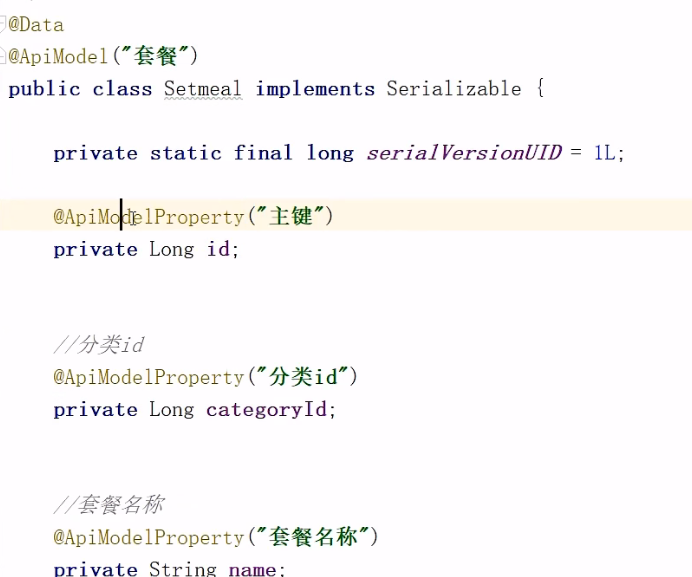
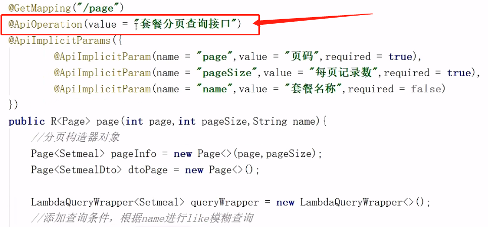
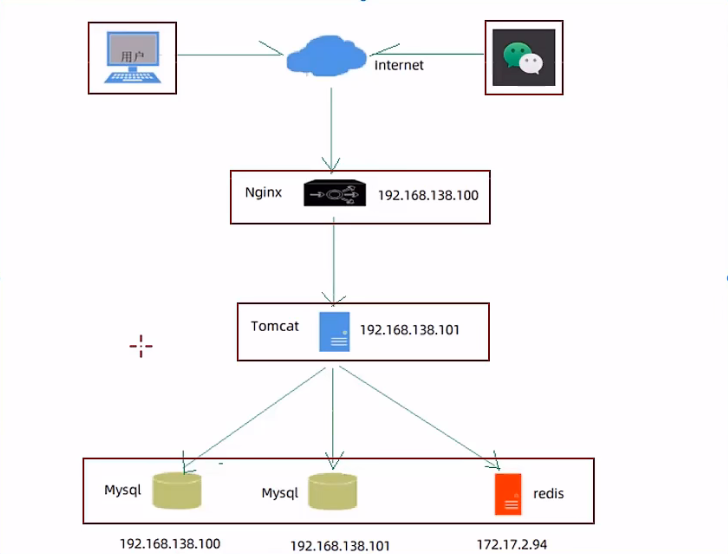

[toc]


# 前后端分离开发技术

> 背景：
>
> - 开发人员同时负责前端和后端代码开发，分工不明确
> - 开发效率低
> - 前后端代码混合在一个工程中，不便于管理
> - 对开发人员要求高，人员招聘困难

# 1 前后端分离开发

## 1.1 介绍

前后端分离开发，就是在项目开发过程中，对于前端代码的开发由专门的前端开发人员负责，后端代码则由后端开发人员负责，这样可以做到**分工明确**、各司其职，提高开发效率，前后端代码并行开发，可以加快项目开发进度。

目前，前后端分离开发方式已经被越来越多的公司所采用，成为当前项目开发的主流开发方式。

前后端分离开发后，从工程结构上也会发生变化，即前后端代码不再混合在同一个maven工程中，而是分为**前端工程**和**后端工程**。



## 1.2 开发流程

前后端分离开发后，面临一个问题，就是前端开发人员和后端开发人员如何进行配合来共同开发一个项目？
可以按照如下流程进行：



==**接口（API接口）**==就是一个http的请求地址，主要就是去定义：请求路径、请求方式、请求参数、响应数据等内容。



## 1.3 前端技术栈（了解）

开发工具：

- Visual Studio Code
- hbuilder

技术框架：

- nodejs
- VUE
- ElementUI
- mock
- webpack


# 2 Yapi（定义API接口）


## 2.1 介绍

YApi是高效、易用、功能强大的api管理平台，旨在为开发、产品、测试人员提供更优雅的接口管理服务。可以帮助开发者轻松创建、发布、维护API，YApi还为用户提供了优秀的交互体验，开发人员只需利用平台提供的接口数据写入工具以及简单的点击操作就可以实现接口的管理。

YApi让接口开发更简单高效，让接口的管理更具可读性、可维护性，让团队协作更合理。

源码地址：https://github.com/YMFE/yapi

要使用YApi，需要自己进行部署。

## 2.2 使用

使用YApi，可以执行下面操作：

- 添加项目
- 添加分类
- 添加接口
- 编辑接口
- 查看接口
- 导入接口
- 导出接口



# 3 Swagger

## 3.1 介绍

使用Swagger你只需要按照它的规范去定义接口及接口相关的信息，再通过Swagger衍生出来的一系列项目和工具，就可以做到**生成各种格式的接口文档**，以及**在线接口调试页面**等等。
官网：https://swagger.io/

**knife4j**是为Java MVC框架**集成Swagger**生成Api文档的增强解决方案。

Maven坐标：

```xml
<dependency>
    <groupld>com.github.xiaoymin</groupld>
    <artifactld>knife4j-spring-boot-starter</artifactld>
    <version>3.0.2</version>
</dependency>
```


## 3.2 使用方式

操作步骤：

1. 导入knife4j的maven坐标

2. 导入knife4j相关配置类（WebMvcConfig）

   ```java
   //开启knife4j注解
   @EnableSwagger2
   @EnableKnife4j 
   public class WebMvcConfig extends WebllvcConfigurationSupport{
       @Bean 
       public Docket createRestApi(){
           //文档类型
   		return new Docket(DocumentationType.SWAGGER_2)
                   .apiInfo(apiInfo())
                   .select()
                   .apis(RequestHandlerSelectors.basePackage("com.itheima.reggie.controller"))
                   .paths(PathSelectors.any())
                   .build();
       }
       private ApiInfo apiInfo(){    
           return new ApiInfoBuilder()
                   .title("瑞吉外卖")
                   .version("1.0")
                   .description("瑞吉外卖接口文档")
                   .build();
       }
   }
   ```

   

3. 设置静态资源，否则接口文档页面无法访问，（WebMvcConfig类中的addResourceHandlers方法）

   ```java
   //设置静态资源映射
   registry.addResourceHandler("doc.html").addResourceLocations("classpath:/META-INF/resources/"); registry.addResourceHandler("/webjars/**").addResourceLocations("classpath:/META-INF/resources/webjars/");
   ```

   

4. 在LoginCheckFilter中设置不需要处理的请求路径 (过滤器放行)

   ```java
   //定义不需要处理的请求路径
   String[] urls = new String[]{
       "/doc.html",
       "/webjars/**",
       "/swagger-resources",
       "/v2/api-docs"
   };
   ```


## 3.3 常用注解

| 注解                 | 说明                                                         |
| -------------------- | ------------------------------------------------------------ |
| `@Api`               | 用在请求的类上，例如Controller，表示对类的说明               |
| `@ApiModel`          | 用在类上，通常是实体类，表示一个返回响应数据的信息           |
| `@ApiModelProperty`  | 用在属性上，描述响应类的属性                                 |
| `@ApiOperation`      | 用在请求的方法上，说明方法的用途、作用（Controller中的方法） |
| `@ApiImplicitParams` | 用在请求的方法上，表示一组参数说明                           |
| `@ApiImplicitParam`  | 用在`@ApilmplicitParams`注解中，指定一个请求参数的各个方面   |








# 4 项目部署

## 4.1 部署架构




## 4.2 部署环境说明

**服务器：**

- **192.168.138.100（服务器A）**

  Nginx：部署前端项目、配置反向代理
  Mysql：主从复制结构中的主库

- **192.168.138.101（服务器B）**

  ​	 jdk：运行Java项目

  ​	git：版本控制工具

  ​	maven：项目构建工具

  ​	jar：Spring Boot项目打成jar包基于内置Tomcat运行

  ​	Mysql：主从复制结构中的从库

- **172.17.2.94（服务器C）**

  ​	Redis：缓存中间件


## 4.3 部署前端项目

操作步骤：

第一步：在服务器A中安装Nginx，将前端项目打包（dist文件）后上传到Nginx的html目录下

第二部：修改Nginx配置文件nginx.conf

```nginx
server {
    listen 80;
    server_name localhost;
    
    location / {
        root html/dist; #指定静态资源根目录
        index index.html;
    }
    
    # 反向代理配置
    location ^~ /api/ {
        # url重写 "/api/employ/login" -> "/employ/login"
        rewrite ^/api/(.*)$ /$1 break;
        proxy_pass http://192.168.138.101:8080; #反向代理配置,将请求转发到指定服务
    }
}

```


## 4.4 部署后端项目

第一步：在服务器B中安装jdk，git，maven，MySQL，使用git clone命令将git远程仓库的代码克隆下来

第二步：将资料中提供的reggieStart.sh（自动化部署脚本）文件上传到服务器B，通过chmod命令设置执行权限

`chmod 777 reggieStart.sh`

第三步：执行reggieStart.sh脚本文件，自动部署项目